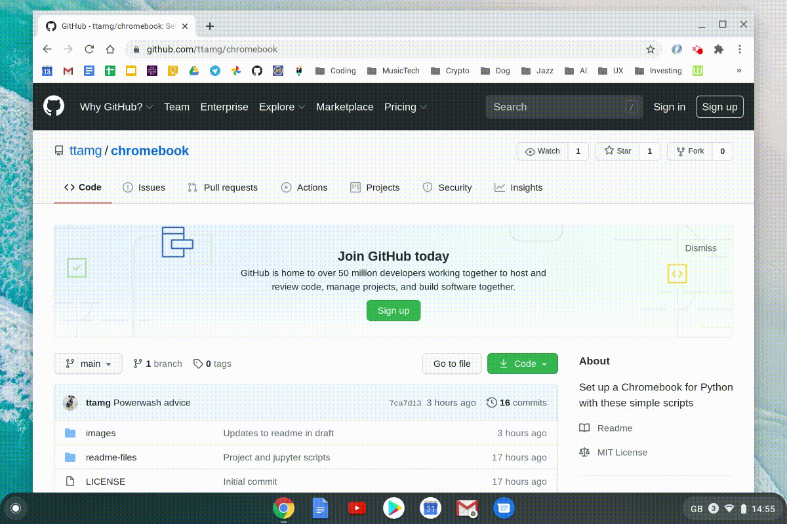
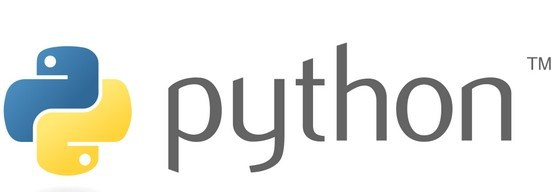
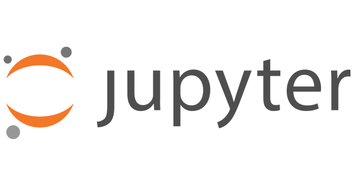
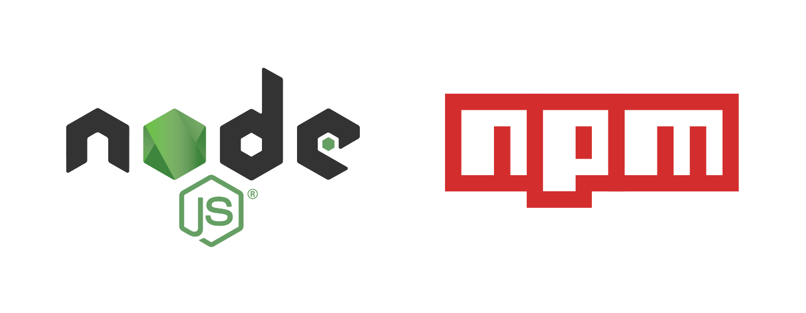
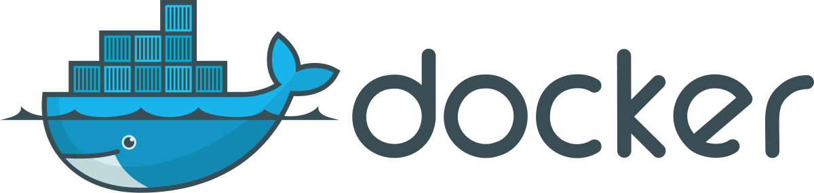
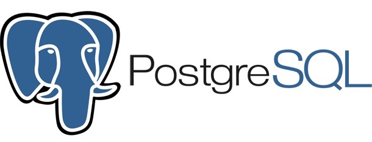

# Chromebook setup for Python development

**This repo provides a set of scripts for installing Python on a Chromebook and creating new projects**.

Installing Python and other developer tools on a Chromebook requires some manual work and is a bit of a hassle.  These scripts simplify and speed up the install on a clean Chromebook.

## Who are these scripts for?

* For anyone like myself using a Chromebook for development and wanting to reinstall Python after a Chromebook *powerwash*.  It is a hassle reinstalling everything from source each time.  These scripts are a time-saver.  

* For Python beginners with a Chromebook - the Linux and Python install is a bit daunting.  Most people want to get started coding rather than spending up to an hour or more doing an install. This should make the install a bit simpler.

Hopefully the scripts are useful to people in the Python community.  Feel free to contribute, extend or adapt.

## Important health warning

**You use these scripts at your own risk.** 

The good thing about a Chromebook is that it is very easy to use a *powerwash* to clear down the machine and start with a fresh install if anything goes wrong.

Scripts are tested on a Google Pixelbook and work cleanly after a powerwash. But they may not work on all Chromebooks.  Use at your own risk.

Tested on Chrome OS versions:
- Version 85.0.4183.133
- Version 86.0.4240.77

## Install Python on Chrome OS

### 1. Starting Chromebook Linux

If you are new to Chromebooks and Python, start your Linux terminal window.

In your Linux terminal on your Chromebook, you can download the scripts by cloning the repository:

    git clone https://github.com/ttamg/chromebook

This will copy the script files into a new *chromebook* directory.

### 2. Installing Python3

the *install-python* script will install a version of Python 3 on your Chromebook.  You can have multiple versions at the same time if you like.

From the *chromebook* folder, run the script and follow the prompts:

    ./install-python.sh

This compiles Python from the source-code so takes at least 5 minutes to run, compile and install.  Ensure your machine has adequate battery power.

### 3. Installing pip and virtualenv

There is a separate script to install pip, and virtualenv, that you will need.  This is separate from the Python install because you only need to install these once, but you might use the *install-python* script multiple times to install multiple Python versions.

From the *chromebook* folder:

    ./install-pip-virtualenv.sh

### 4. Job done

You should now have a working Python installation and can get coding.

## Project start scripts

These are simple scripts that create new Python or Jupyter projects without having to remember how to create new virtual environments.

### A. Start a new Python project

Starting a new Python project involves creating a new project folder, creating a new virtual environment for you to install Python packages using pip, and then getting started.  It's not hard, but a bit fiddly if you don't do it week in and week out.

The *start-python-project* script automates this:

From the *chromebook* folder:

    ./start-python-project.sh

### B. Start a new Jupyter Lab project

If you want to use Jupyter notebooks to create some Python code or run some data science analysis, then Jupyter runs well on the Chromebook.

The *start-jupyter-project* script creates a new Python project and virtual environment, and then install Jupyter Lab for you.

From the *chromebook* folder:

    ./start-jupyter-project.sh

## Installing Nodejs and NPM

For front-end development, or back-end NodeJS, we can install NodeJS and NPM.

from the *chromebook* folder:

    ./install-npm.sh

## Other developer installation scripts

These scripts are more likely to be helpful to those who are doing more serious Python development on their Chromebook and needs tools such as databases or Docker.

### Install Docker

Docker can be quite resource hungry so it may not work well, or at all, on low-end Chromebooks.

This script installs the Docker dependences, Docker and runs the test container to confirm installation worked.

From the *chromebook* folder:

    ./install-docker.sh

### Install SQLite

We don't need a script for this. From the command line just use the normal installation command:

    sudo apt-get install sqlite3

### Install Postgres

If you want a local Postgres database, [these instructions for installing Postgres on Ubuntu seem to work well on the Chromebook](https://www.digitalocean.com/community/tutorials/how-to-install-and-use-postgresql-on-ubuntu-20-04).

## Contributors

If you find some bugs in the scripts or updates that should be made, please raise an issue or (better still) a pull request.  We don't promise to fix everything, but would like this to be a resource that helps people, particularly those new to Python.

## And finally

If you find this useful, then please give the repo a star (click on the Github star at the top right of the screen) so that others find this repo more easily.
